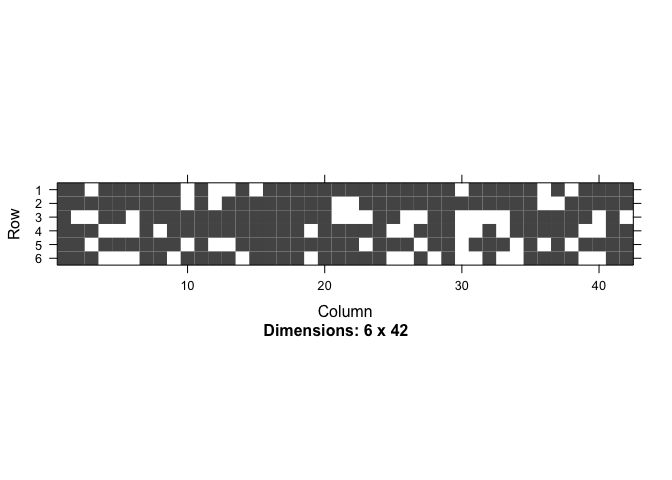
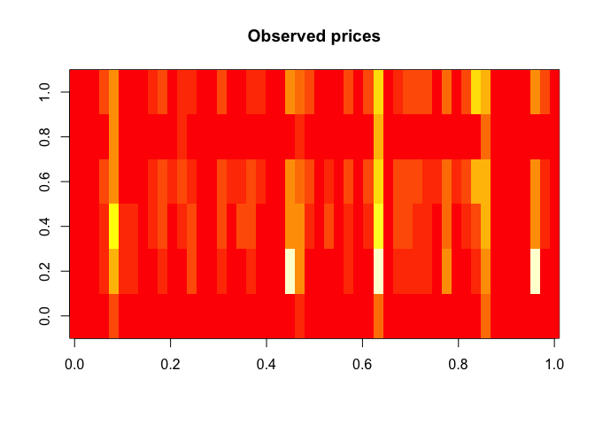
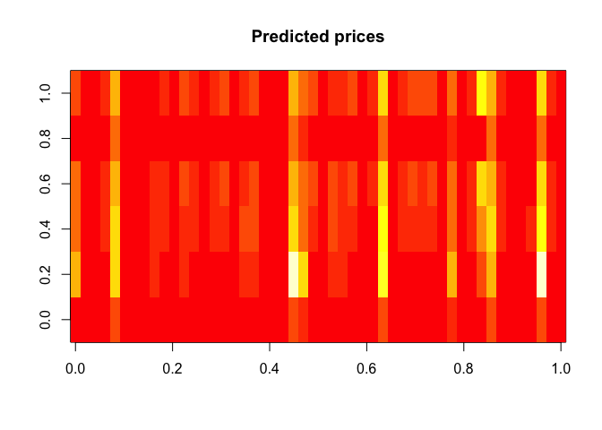
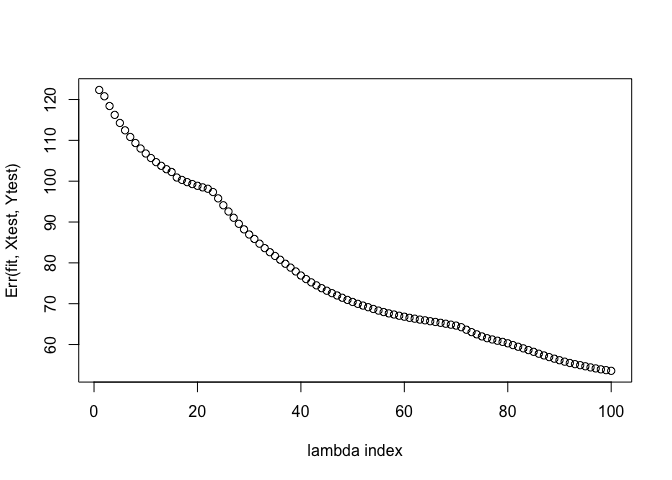

## Quick Start (for lsgl version 1.3.7)

### 1\. Load the msgl library in R

``` r
library(lsgl)
```

### 2\. Load your data

Load data containing N samples and p features (covariates) and a
response matrix containing K responses for each sample:

``` r
X <- # load design matrix (of size N x p)
Y <- # load response matrix (of size N x K)
```

For the purpose of this tutorial we will load a data set consisting of
airline ticket prices

``` r
data(AirlineTicketPrices)
dim(X)
```

    ## [1] 337 411

``` r
dim(Y)
```

    ## [1] 337   6

Hence, p = 411, N = 337 and the dimension of the response K = 6, this
implies that the model has 6\*(411+1) = 2472 parameters.

Let us take out a small test set:

``` r
idx <- sample(1:nrow(X), size = 50)

Xtest <- X[idx, ]
Ytest <- Y[idx, ]
X <- X[-idx, ]
Y <- Y[-idx, ]
```

### 3\. Estimate error using cross validation

Choose `lambda` (fraction of lambda.max) and `alpha`, with `alpha = 1`
for lasso, `alpha = 0` for group lasso and `alpha` in the range (0,1)
for spares group lasso.

Use `lsgl::cv` to estimate the error for each lambda in a sequence
decreasing from the data derived *lambda max* to `lambda` \* *lambda
max*. Lambda max is the lambda at which the first penalized parameter
becomes non-zero. A smaller `lambda` will take longer to fit and include
more features. The following command will run a 10 fold cross validation
for each lambda value in the lambda sequence using 2 parallel units
(using the [foreach](https://CRAN.R-project.org/package=foreach) and
[doParallel](https://CRAN.R-project.org/package=doParallel) packages.

``` r
cl <- makeCluster(2)
registerDoParallel(cl)

# Do cross validation -- this may take some time
fit.cv <- lsgl::cv(X, Y, fold = 10, alpha = 0.5, lambda = 0.01, use_parallel = TRUE)
```

    ## Warning: 'cBind' is deprecated.
    ##  Since R version 3.2.0, base's cbind() should work fine with S4 objects

    ## 
    ## Running lsgl 10 fold cross validation 
    ## 
    ##  Samples:  Features:  Models:  Groups:  Parameters: 
    ##        287        412        6      412       2.472k

``` r
stopCluster(cl)
```

(for the current version *no progress bar will be shown*)

**Get a summery of the validated models.** We have now cross validated
the models corresponding to the lambda values, one model for each lambda
value. We may get a summery of this validation by doing:

``` r
fit.cv
```

    ## 
    ## Call:
    ## lsgl::cv(x = X, y = Y, alpha = 0.5, lambda = 0.01, fold = 10, 
    ##     use_parallel = TRUE)
    ## 
    ## Models:
    ## 
    ##  Index:  Lambda:  Features:  Parameters:  Error: 
    ##        1    1.000          3           18     135
    ##       20    0.413        4.6         27.6     105
    ##       40    0.163        9.8         56.7      80
    ##       60    0.064       14.9         85.6      67
    ##       80    0.025       28.2        138.5      59
    ##      100    0.010       44.5        193.2      53
    ## 
    ## Best model:
    ## 
    ##  Index:  Lambda:  Features:  Parameters:  Error: 
    ##      100     0.01       44.5        193.2      53

Hence, the best model is obtained using lambda index 100 and it has a
cross validation error of 52.63. The expected number of selected
features is 44.5 and the expected number of parameters is 193.2.

### 4\. Fit the final model

Use lsgl to fit a final model.

``` r
fit <- lsgl::fit(X, Y, alpha = 0.5, lambda = 0.01)
```

    ## 
    ## Running lsgl 
    ## 
    ##  Samples:  Features:  Models:  Groups:  Parameters: 
    ##        287        412        6      412       2.472k

**Get a summery of the estimated models**

``` r
fit
```

    ## 
    ## Call:
    ## lsgl::fit(x = X, y = Y, alpha = 0.5, lambda = 0.01)
    ## 
    ## Models:
    ## 
    ##  Index:  Lambda:  Features:  Parameters: 
    ##        1    1.000          3           18
    ##       20    0.413          6           36
    ##       40    0.163         10           58
    ##       60    0.064         16           93
    ##       80    0.025         26          126
    ##      100    0.010         42          187

**Take a look at the estimated models.** As we saw in the previous step
the model with index 100 had the best cross validation error, we may
take a look at the included features using the
command:

``` r
features(fit)[[best_model(fit.cv)]][1:10] # Ten first non-zero features in best model
```

    ##  [1] ""                  "'ALLnumquotesA'"   "'ALLnumquotesA'l1"
    ##  [4] "'ALLnumquotesA'l7" "'ALLminp0'"        "'ALLminp0'l1"     
    ##  [7] "'ALLnumquotes4'l2" "'aAAminp0'l1"      "'aAAminp0'l2"     
    ## [10] "'aCOminpA'"

Hence 42 features are included in the model, this is close to the
expected number based on the cross validation estimate.

The sparsity structure of the parameters belonging to these 42 features
may be viewed using

``` r
image(parameters(fit)[[best_model(fit.cv)]])
```

<!-- --> We may
also take a look at the estimate parameters (or
coefficients)

``` r
coef(fit, best_model(fit.cv))[,1:5] # First 5 non-zero parameters of best model
```

    ## 6 x 5 sparse Matrix of class "dgCMatrix"
    ##                                'ALLnumquotesA' 'ALLnumquotesA'l1
    ## LBL+ALLminpA+fut_001  91.82393   -1.236003e-05       .          
    ## LBL+ALLminp0+fut_001 -53.14964   -5.374433e-06       0.006200295
    ## LBL+aDLminpA+fut_001 -17.84331    .                  .          
    ## LBL+aCOminpA+fut_001 -24.04310    9.595046e-06       0.019909180
    ## LBL+aFLminpA+fut_001  54.48162   -1.332136e-05       .          
    ## LBL+aUAminpA+fut_001 -49.44576    8.619017e-06       0.024576489
    ##                      'ALLnumquotesA'l7 'ALLminp0'
    ## LBL+ALLminpA+fut_001      -0.008327093 0.05548541
    ## LBL+ALLminp0+fut_001      -0.023200631 0.28014445
    ## LBL+aDLminpA+fut_001      -0.003197099 0.05273291
    ## LBL+aCOminpA+fut_001       .           .         
    ## LBL+aFLminpA+fut_001      -0.008033362 0.03438073
    ## LBL+aUAminpA+fut_001       .           .

If we count the total number of non-zero parameters in the model we get,
in this case 187 which is close to the expected based on the cross
validation estimate.

### 6\. Use your model for predictions

**Load test data** containing M samples and p features.

``` r
Xtest <- # load matrix with test data (of size M x p)
```

Use the final model to predict the price vector of the M=50 samples in
Xtest.

``` r
res <- predict(fit, Xtest)
```

Plot predicted and true response

``` r
image(Ytest, main = "Observed prices")
```

<!-- -->

``` r
image(res$Yhat[[best_model(fit.cv)]], main = "Predicted prices")
```

<!-- -->

Compute the error rates on the test set

``` r
plot(Err(fit, Xtest, Ytest), xlab = "lambda index")
```

<!-- -->
